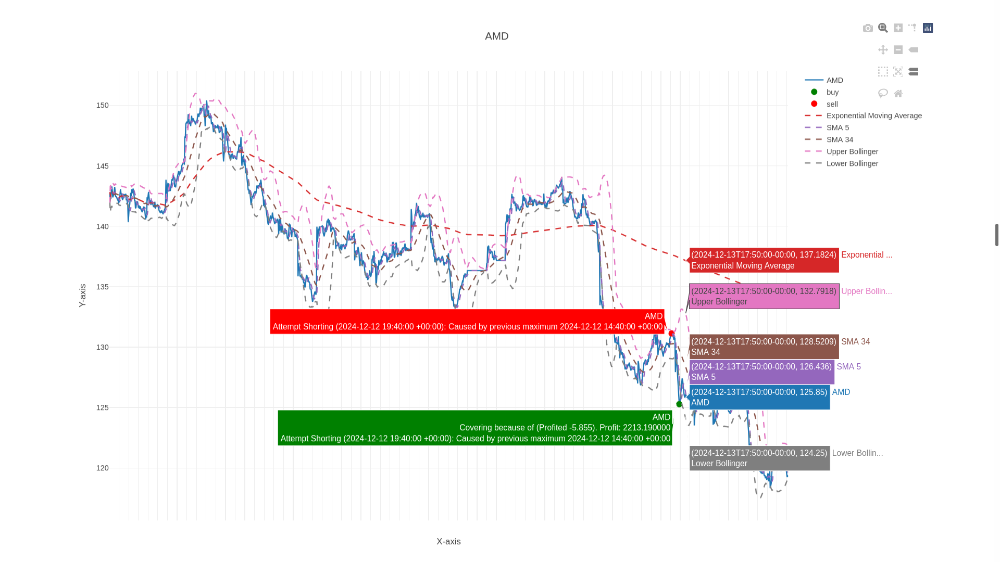

# Longleaf

An algorithmic trading platform written in OCaml that supports live trading, paper trading, and backtesting. The platform uses a functional, modular architecture with strategies implemented using GADTs (Generalized Algebraic Data Types) for maximum type safety and composability.

## Features

- **Multiple execution modes**: Backtesting, paper trading, and live trading
- **Brokerage support**: Alpaca (with extensible backend system)
- **Market data sources**: Alpaca and Tiingo
- **Technical indicators**: Integration with TA-lib via tacaml
- **Web dashboard**: Real-time React GUI for strategy management
- **GADT-based strategies**: Type-safe strategy composition with functional approach

## Installation

### Prerequisites

1. **Install Guix**: Follow the installation guide at https://guix.gnu.org/
2. **Install opam**: OCaml package manager

### Dependencies

3. **Install tacaml**: OCaml bindings for TA-lib technical analysis from the separate tacaml repository:

### Build and Install

4. **Install and run Longleaf**:
   ```bash
   make install
   make run
   ```

This will:
- Build the OCaml components with dune
- Install all necessary dependencies
- Set up Python tearsheet server
- Set up OCaml strategy control server
- Serve the GUI frontend at localhost:3000

## Setup

Create a `.envrc` file in the project root with your API keys:

```bash
export APCA_API_KEY_ID=your_alpaca_key_id
export APCA_API_SECRET_KEY=your_alpaca_secret_key
export TIINGO_KEY=your_tiingo_key
```

## Usage

### Web Interface

Once the platform is running with `make run`, access the React GUI at:

**http://localhost:3000**

The web interface allows you to:
- Select and configure strategies
- Start backtesting, paper trading, or live trading
- Monitor real-time portfolio performance
- View technical indicator charts
- Analyze strategy statistics and metrics

### Command Line (Alternative)

You can also run strategies directly from the command line:

```bash
# Download historical data
longleaf_downloader tiingo --begin=2024-01-01 --end=2024-12-31 --interval=10 --timeframe=minute data/24.json

# Run backtest
longleaf Backtest SEAKING data/24.json -i 100

# Paper trading
longleaf Paper --preload download -o papertrading.log

# Live trading (⚠️ trades real money!)
longleaf Live --preload download -o live_trading.log
```

## Creating Custom Strategies

Strategies are now implemented using GADTs for type safety and composability. See examples in `strategies/gadt/gadt_examples.ml`:

### Basic Strategy Structure

```ocaml
let my_strategy = 
  register @@ {
    name = "My Strategy";
    buy_trigger = 
      close >. Const (100.0, Float) 
      &&. (rsi () <. Const (30.0, Float));
    sell_trigger = 
      close <. Const (95.0, Float) 
      ||. (rsi () >. Const (70.0, Float));
    max_positions = 2;
    position_size = 0.1;
  }
```

### Available Indicators and Operations

- **Technical Indicators**: `sma()`, `tema()`, `rsi()`, `macd()`, `bollinger_bands()`, etc.
- **Price Data**: `close`, `open_`, `high`, `low`, `volume`
- **Comparisons**: `>.`, `<.`, `=.`
- **Logic**: `&&.`, `||.`
- **Constants**: `Const (value, type)`

### Example Strategies

The `gadt_examples.ml` file contains several example strategies:

- **Listener**: Data collection strategy (never trades)
- **SEAKING**: Dual SMA + RSI strategy
- **Bollinger Momentum**: Bollinger bands with momentum
- **Mean Reversion**: RSI-based mean reversion
- **Volume Breakout**: Volume-based breakout detection

### Adding New Strategies

1. Define your strategy in `strategies/gadt/gadt_examples.ml`
2. Use the `register` function to add it to the strategy list
3. The strategy will automatically appear in the web interface
4. Test with backtesting before live deployment

## Available Execution Modes

- **Backtesting**: Test strategies on historical data
- **Paper Trading**: Simulate live trading with real market data
- **Live Trading**: Execute real trades (use with extreme caution)

## Technical Architecture

The platform follows a functional architecture:

**Parse options → Create backend → Instantiate strategy → Execute strategy**

Key components:
- **GADT Strategy System**: Type-safe strategy composition
- **Backend Abstraction**: Same strategy code works across all execution modes
- **Eio Concurrency**: Separate domains for strategy execution and web server
- **React Frontend**: Real-time visualization and control interface

## Graceful Shutdown

Stop the platform safely:
```bash
make shutdown
# or
longleaf_shutdown
```

## Command Line Help

All executables provide detailed help:
```bash
longleaf --help
longleaf_downloader --help
longleaf_shutdown --help
```

## Contributing

This is an active project under development. The GADT-based strategy system provides a powerful, type-safe way to compose trading strategies. See the examples in `gadt_examples.ml` to get started with strategy development.
